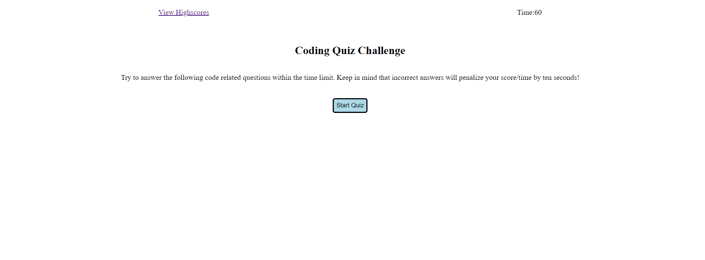

# 04 Web API's: Code Quiz

Fourth homework which requires you to answer quiz questions and save them to localStorage. This app will run in the browser and will feature dynamically updated HTML and CSS powered by JavaScript code. Technical challenges include:

- DOM manipulation
-
- Conditional Statements
- Object Manipulation
- Helper Functions
- Local Storage

Live demo found [HERE](https://sxtnkyl.github.io/04-CodeQuiz/)!
